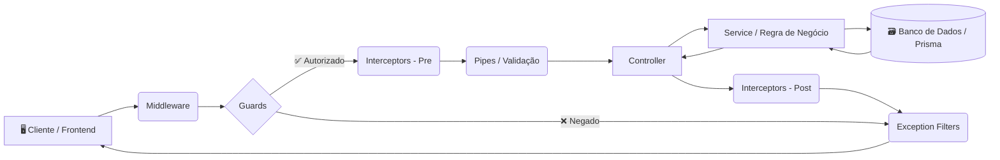

<div align="center">

<a href="http://nestjs.com/" target="_blank">
  
</a>

# 🎓 Estudos Avançados de Programação

**Tecnologia em Análise e Desenvolvimento de Sistemas**
**Instituto Federal do Paraná (IFPR) — Campus Irati**

<br>


</div>

---

## 📚 Tabela de Conteúdos

> Navegue rapidamente pelas seções do projeto.

| # | Seção |
|:-:|:------|
| 1 | [📖 Sobre o Projeto](#-sobre-o-projeto) |
| 2 | [🎯 Objetivos Acadêmicos](#-objetivos-acadêmicos) |
| 3 | [🛠️ Pilha de Tecnologias](#️-pilha-de-tecnologias) |
| 4 | [🏛️ Arquitetura e Conceitos](#️-arquitetura-e-conceitos) |
| 5 | [🔑 Conceitos Aplicados](#-conceitos-aplicados) |
| 6 | [🚀 Instalação e Execução](#-instalação-e-execução) |
| 7 | [📂 Estrutura de Pastas](#-estrutura-de-pastas) |
| 8 | [👨‍💻 Autor](#-autor) |
| 9 | [📄 Licença](#-licença) |

---

## 📖 Sobre o Projeto

> Este repositório contém a implementação prática dos conceitos avançados de desenvolvimento **Backend** utilizando o framework **NestJS**, desenvolvida no contexto da disciplina de **Desenvolvimento Web III** do curso de Tecnologia em Análise e Desenvolvimento de Sistemas do **IFPR — Campus Irati**.

O projeto evoluiu de forma incremental através de módulos de aprendizado, culminando em uma **API RESTful completa** com autenticação, validação de dados, tratamento de erros e integração com banco de dados — consumida por um Frontend desenvolvido em **React**.

---

## 🎯 Objetivos Acadêmicos

| Ícone | Tópico | Descrição |
|:-----:|:-------|:----------|
| 🧩 | **Arquitetura Modular** | Organização de código em Módulos, Controllers e Services. |
| 🗃️ | **ORM e Banco de Dados** | Modelagem de dados com relacionamentos (1:N) usando Prisma e SQLite. |
| ✅ | **Qualidade de Código** | Uso de DTOs (Data Transfer Objects) e Pipes de validação. |
| 🔐 | **Segurança** | Autenticação com JWT, hashing de senhas com Bcrypt e Guards de rota. |
| 🔄 | **Interceptação de Requisições** | Uso de Middlewares, Interceptors e Exception Filters. |

---

## 🛠️ Pilha de Tecnologias

### Backend (API)

| Tecnologia | Função no Projeto |
|:-----------|:------------------|
| **NestJS** | Framework principal (Node.js) que estrutura toda a API. |
| **TypeScript** | Superset do JavaScript com tipagem estática. |
| **Prisma Client** | ORM para comunicação com o banco de dados. |
| **SQLite** | Banco de dados relacional leve (arquivo `dev.db`). |
| **Passport-JWT** | Estratégia de autenticação via tokens JWT. |
| **Bcrypt** | Hashing seguro de senhas dos usuários. |
| **Class-validator** | Validação declarativa de DTOs via decorators. |
| **Class-transformer** | Transformação e serialização de objetos de dados. |

### Frontend (Interface)

| Tecnologia | Função no Projeto |
|:-----------|:------------------|
| **React.js** | Biblioteca principal para construção da interface. |
| **CSS Modules** | Estilização isolada por componente. |
| **Fetch API / Axios** | Consumo dos endpoints da API NestJS. |

---

## 🏛️ Arquitetura e Conceitos

> A aplicação segue o **fluxo de requisição padrão do NestJS**, garantindo separação de responsabilidades e segurança aplicada em camadas.



---

## 🔑 Conceitos Aplicados

| Conceito | Arquivo de Referência | Responsabilidade |
|:---------|:---------------------|:-----------------|
| 📦 **DTOs** | `create-task.dto.ts` | Definem a forma como os dados trafegam pela rede, garantindo contratos de entrada e saída. |
| 🔩 **Pipes** | `ValidationPipe` (global) | Validação e transformação automática dos dados antes de chegarem ao Controller. |
| 🛡️ **Guards** | `auth-token.guard.ts` | Determinam se uma requisição está autorizada a acessar uma rota protegida via JWT. |
| 🔄 **Interceptors** | `logger.interceptor.ts` / `add-header.interceptor.ts` | Interceptam a execução antes e depois do método do Controller para logging e modificações. |
| 🔗 **Middleware** | `logger.middleware.ts` | Funções executadas antes do roteamento, usadas para logging e pré-processamento. |
| 🚨 **Exception Filters** | `http-exception.filter.ts` | Camada de tratamento centralizado para erros não capturados na aplicação. |

---

## 🚀 Instalação e Execução

### 📋 Pré-requisitos

| Requisito | Detalhe |
|:----------|:--------|
| **Node.js** | Versão **18 ou superior** instalada e configurada no `PATH`. |
| **npm ou yarn** | Gerenciador de pacotes para instalar as dependências. |
| **Git** | Para clonar o repositório. |

---

### ⚙️ 1. Configuração do Backend

**Clone o repositório e instale as dependências:**

```bash
git clone https://github.com/VictorHJesusSantiago/projeto_nest.git
cd projeto_nest
npm install
```

**Configure as variáveis de ambiente:**

Crie um arquivo `.env` na raiz do projeto com o seguinte conteúdo:

```env
# ──────────────────────────────────────
# Banco de Dados (Prisma / SQLite)
# ──────────────────────────────────────
DATABASE_URL="file:./dev.db"

# ──────────────────────────────────────
# Autenticação JWT
# ──────────────────────────────────────
JWT_SECRET="sua_chave_secreta_aqui"
```

**Execute as migrações e inicie o servidor:**

```bash
# Aplicar as migrações do banco de dados
npx prisma migrate dev

# Iniciar o servidor em modo de desenvolvimento
npm run start:dev
```

---

### 🎨 2. Configuração do Frontend

```bash
# Em um novo terminal, acesse a pasta do frontend
cd frontend

# Instale as dependências
npm install

# Inicie a aplicação React
npm start
```

---

### 🛰️ Endereços de Acesso

| Serviço | URL |
|:--------|:----|
| 🔌 **API NestJS** | `http://localhost:3000` |
| 🖥️ **Frontend React** | `http://localhost:3001` |
| 🗃️ **Prisma Studio** (BD visual) | `npx prisma studio` → `http://localhost:5555` |

---

## 📂 Estrutura de Pastas

```plaintext
projeto_nest/
│
├── 📄 .env                              # ⚙️  Variáveis de ambiente (não versionar)
├── 📄 package.json                      # 📦 Dependências e scripts do projeto
├── 📄 tsconfig.json                     # 🔧 Configuração do TypeScript
│
├── 📁 prisma/
│   ├── 📄 schema.prisma                 # 🏛️  Modelos e relações do banco de dados
│   └── 📄 dev.db                        # 🗃️  Arquivo SQLite gerado
│
├── 📁 src/
│   ├── 📄 main.ts                       # ▶️  Bootstrap da aplicação NestJS
│   ├── 📄 app.module.ts                 # 🧩 Módulo raiz da aplicação
│   │
│   ├── 📁 auth/                         # 🔐 Módulo de autenticação (JWT + Bcrypt)
│   │   ├── 📄 auth.module.ts
│   │   ├── 📄 auth.controller.ts
│   │   ├── 📄 auth.service.ts
│   │   └── 📄 auth-token.guard.ts       # 🛡️  Guard de proteção de rotas
│   │
│   ├── 📁 tasks/                        # 📋 Módulo de tarefas (CRUD principal)
│   │   ├── 📄 tasks.module.ts
│   │   ├── 📄 tasks.controller.ts
│   │   ├── 📄 tasks.service.ts
│   │   └── 📁 dto/
│   │       └── 📄 create-task.dto.ts    # 📦 DTO de criação de tarefa
│   │
│   ├── 📁 interceptors/                 # 🔄 Interceptors de logging e headers
│   │   ├── 📄 logger.interceptor.ts
│   │   └── 📄 add-header.interceptor.ts
│   │
│   ├── 📁 middleware/                   # 🔗 Middlewares da aplicação
│   │   └── 📄 logger.middleware.ts
│   │
│   └── 📁 filters/                      # 🚨 Filtros de exceção globais
│       └── 📄 http-exception.filter.ts
│
└── 📁 frontend/                         # 🎨 Aplicação React (consumidor da API)
    ├── 📄 package.json
    └── 📁 src/
        ├── 📄 App.tsx
        └── 📁 components/
```

---

## 👨‍💻 Autor

<div align="center">

<br>

**Victor H. J. Santiago**

Desenvolvido sob orientação do **Prof. Dr. Robyson Aggio**
Instituto Federal do Paraná — Campus Irati
*Disciplina: Desenvolvimento Web III*

<br>

[](https://github.com/VictorHJesusSantiago)
[](https://www.linkedin.com/in/victor-henrique-de-jesus-santiago/)

</div>

---

## 📄 Licença

<div align="center">

Este projeto foi desenvolvido para fins **estritamente acadêmicos** no âmbito do
**Instituto Federal do Paraná — Campus Irati**.
Seu uso, reprodução ou distribuição deve respeitar as diretrizes institucionais do IFPR.


</div>

---

<div align="center">

*Feito com 💙 e NestJS por **Victor H. J. Santiago***

</div>
