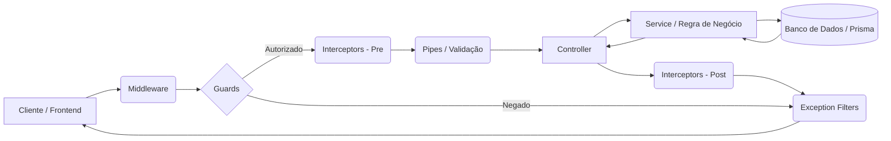

<div align="center">
 <a href="http://nestjs.com/" target="blank"></a>

  # ESTUDOS AVANÇADOS DE PROGRAMAÇÃO

  **TECNOLOGIA EM ANÁLISE E DESENVOLVIMENTO DE SISTEMAS**<br>
  Instituto Federal do Paraná (IFPR) - Campus Irati

  <div style="display: flex; justify-content: center; gap: 10px; margin: 20px 0;">
    
    
    
    
    
  </div>
</div>

<p align="center">
  <a href="#-sobre-o-projeto">Sobre</a> •
  <a href="#-tecnologias-utilizadas">Tecnologias</a> •
  <a href="#-arquitetura-e-conceitos">Arquitetura</a> •
  <a href="#-instalação-e-execução">Instalação</a> •
  <a href="#-documentação-da-api">Endpoints</a> •
  <a href="#-estrutura-de-pastas">Estrutura</a>
</p>

---

## 📖 Sobre o Projeto

Este repositório contém a implementação prática dos conceitos avançados de desenvolvimento Backend utilizando o framework **NestJS**. O projeto evoluiu incrementalmente através de módulos de aprendizado, culminando em uma API RESTful completa com autenticação, validação de dados, tratamento de erros e integração com banco de dados, consumida por um Frontend em **React**.

### Objetivos Acadêmicos

O projeto visa demonstrar competência nos seguintes tópicos:

* **Arquitetura Modular:** Organização de código em Módulos, Controllers e Services.
* **ORM e Banco de Dados:** Modelagem de dados (1:N) utilizando Prisma e SQLite.
* **Qualidade de Código:** Uso de DTOs (Data Transfer Objects) e Pipes de validação.
* **Segurança:** Implementação de Autenticação (JWT), Hashing de senhas (Bcrypt) e Guards.
* **Interceptação de Requisições:** Uso de Middlewares, Interceptors e Exception Filters.

---

## 🛠 Tecnologias Utilizadas

### Backend (API)

* **Core:** NestJS (Node.js Framework)
* **Linguagem:** TypeScript
* **ORM:** Prisma Client
* **Banco de Dados:** SQLite (Arquivo `dev.db`)
* **Autenticação:** Passport-JWT & Bcrypt
* **Validação:** Class-validator & Class-transformer

### Frontend (Interface)

* **Biblioteca:** React.js
* **Estilização:** CSS Modules / Standard CSS
* **Consumo de API:** Fetch API / Axios

---

## 🏛 Arquitetura e Conceitos

A aplicação segue o fluxo de requisição padrão do NestJS, garantindo a separação de responsabilidades e segurança em camadas.


### Conceitos Aplicados

* **DTOs (Data Transfer Objects):** Definem a forma como os dados são enviados pela rede (ex: `create-task.dto.ts`).
* **Pipes:** Utilizados para validação e transformação de dados (ex: `ValidationPipe` global).
* **Guards:** Determinam se uma requisição deve ser tratada pelo manipulador de rota (ex: `auth-token.guard.ts` para proteger rotas com JWT).
* **Interceptors:** Interceptam a execução antes e depois do método (ex: `logger.interceptor.ts`, `add-header.interceptor.ts`).
* **Middleware:** Funções executadas antes do manipulador de rota (ex: `logger.middleware.ts`).
* **Exception Filters:** Camada responsável pelo tratamento de erros não capturados (ex: `http-exception.filter.ts`).

---

## 🚀 Instalação e Execução

Siga os passos abaixo para executar o projeto localmente.

### Pré-requisitos

* Node.js (v18 ou superior)
* npm ou yarn

### 1. Configuração do Backend

```bash
# Clone este repositório
$ git clone [https://github.com/VictorHJSantiago/projeto_nest.git](https://github.com/VictorHJSantiago/projeto_nest.git)

# Acesse a pasta do projeto
$ cd projeto_nest

# Instale as dependências
$ npm install

# Configure as variáveis de ambiente
# Crie um arquivo .env na raiz e adicione:
# DATABASE_URL="file:./dev.db"
# JWT_SECRET="sua_chave_secreta_md5"

# Execute as migrações do banco de dados (Prisma)
$ npx prisma migrate dev

# Inicie o servidor de desenvolvimento
$ npm run start:dev
```

### 2. Configuração do Frontend

```bash
# Em um novo terminal, acesse a pasta frontend
$ cd frontend

# Instale as dependências
$ npm install

# Inicie a aplicação React
$ npm start
```
<div align="center"> <h2>👨‍💻 Autor</h2> <p>Desenvolvido por <strong>Victor H. J. Santiago</strong>


Sob orientação do <strong>Prof. Dr. Robyson Aggio</strong>.</p> <p><strong>Instituto Federal do Paraná - Campus Irati</strong>


<em>Disciplina de Desenvolvimento Web III</em></p>

<sub>Feito com 💙 e NestJS.</sub>

</div>
